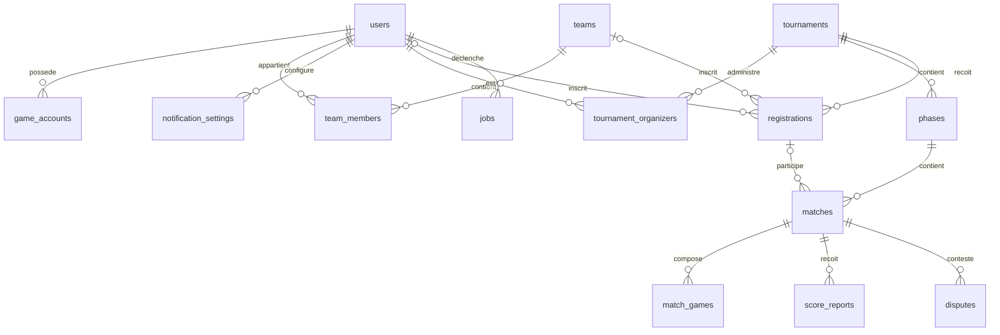

# PA Tournament — Document de spécifications fonctionnelles

> **Statut :** Draft — périmètre fonctionnel validé (modules 4.1 à 4.5)
> **Dernière mise à jour :** 10/06/2026

---

## 1. Contexte & objectif

Application web de gestion de tournois compétitifs (esport / multigaming en priorité, extensible à d'autres disciplines). L'application doit permettre de créer un tournoi, gérer les inscriptions de participants ou d'équipes, générer et suivre un arbre de tournoi, et saisir les résultats jusqu'à la finale.

Inspiration UX : Challonge / Toornament.

## 2. Stack technique

| Couche | Technologie | Rôle |
|---|---|---|
| Frontend | React | SPA, interface utilisateur |
| Backend | Kotlin + Spring Boot | API REST, logique métier (dont génération des brackets), persistance |
| Worker | Rust | Import / export Excel des membres d'équipes (traitement asynchrone de fichiers) |
| Auth | Keycloak | Authentification / autorisation (OIDC), gestion des rôles |
| Infra | GCP / Cloud Run | Hébergement conteneurisé serverless |
| BDD | PostgreSQL (conteneur Docker) | Persistance |

## 3. Rôles utilisateurs

- **Visiteur** : consultation publique des tournois et brackets
- **Joueur** : inscription, gestion de profil, participation
- **Capitaine d'équipe** : gestion de son équipe et de son roster
- **Organisateur** : création et administration de ses tournois
- **Admin plateforme** : modération globale

## 4. Modules fonctionnels

### 4.1 Gestion des tournois

- **Création de tournoi** : nom, jeu/discipline, description, dates (ouverture/fermeture des inscriptions, début, fin), visibilité publique ou privée
- **Formats supportés (V1)** :
  - Élimination simple
  - Élimination double (winner + loser bracket)
  - Hybride : phase de poules → arbre final
- **Formats post-V1** :
  - Round robin (poules)
  - Système suisse
- **Paramétrage** : nombre maximum de participants, taille des équipes (solo / 2v2 / 5v5…), format des matchs par round (BO1 / BO3 / BO5), check-in obligatoire ou non
- **Cycle de vie** : `draft` → `inscriptions ouvertes` → `check-in` → `en cours` → `terminé` / `annulé`
- **Co-organisateurs** : plusieurs comptes peuvent administrer un même tournoi

### 4.2 Arbre de tournoi (bracket)

- **Génération automatique** du bracket à partir des inscrits — réalisée par le backend Kotlin
- **Seeding** : aléatoire ou manuel (drag & drop). Le seeding basé sur un classement/ELO est post-V1 (nécessite une table de classement non incluse dans le schéma actuel).
- **Gestion des byes** quand le nombre de participants n'est pas une puissance de 2
- **Visualisation interactive** : zoom/pan, affichage du loser bracket en double élimination, accès au détail de chaque match depuis l'arbre
- **Re-génération** possible tant que le tournoi n'a pas démarré

### 4.3 Participants / Équipes / Inscriptions

- **Profil joueur** : pseudo, jeux pratiqués, identifiants in-game (Riot ID, etc.)
- **Équipes persistantes** : création, logo, tag, roster, invitations par lien ou recherche, rôles capitaine/membre, gestion des remplaçants
- **Import / export Excel des membres d'équipes** : traité de manière asynchrone par le **Worker Rust** (parsing des fichiers `.xlsx` à l'import, génération des fichiers à l'export)
- **Inscription** solo ou par équipe selon le format du tournoi
- **Liste d'attente** quand le tournoi est complet
- **Validation manuelle** des inscriptions par l'organisateur (optionnel)
- **Check-in** : confirmation de présence X minutes avant le début ; les no-shows sont remplacés par la liste d'attente

### 4.4 Matchs & résultats

- **Saisie des scores** : par l'organisateur, ou déclaration par les deux capitaines avec validation croisée
- **Système de litige** en cas de désaccord : dépôt de preuve (screenshot), arbitrage par l'organisateur
- **Forfait / disqualification** avec propagation automatique dans l'arbre
- **Planification** : horaire prévu par match, assignation possible de "stations" (postes physiques)

### 4.5 Compte & profil utilisateur

- **Authentification via Keycloak** (OIDC) — toutes les connexions passent par Keycloak, avec deux modes d'entrée :
  - Inscription classique : email + mot de passe gérés par Keycloak
  - Connexion fédérée (SSO) : "Se connecter avec Google / Discord", Keycloak délègue la vérification au fournisseur, aucun mot de passe stocké côté plateforme
- **Historique** des tournois joués, palmarès, statistiques (winrate)

## 5. Fonctionnalités transverses

- **Temps réel** : mise à jour live des brackets et des scores (WebSocket ou SSE) pour les spectateurs et participants
- **Notifications configurables** : l'utilisateur choisit ses canaux (email, webhook Discord…) et les événements qui le notifient ("ton match commence dans 10 min", "ton inscription est validée", "résultat contesté"…)
- Page publique de tournoi partageable
- Mode "écran spectateur" plein écran (affichage du bracket en continu)
- Export du bracket en image / PDF

## 6. Schéma de base de données

### 6.1 Décisions de modélisation

1. **Communication Backend / Worker** : table `jobs` en BDD, pollée par le Worker Rust. Simple, gratuit, suffisant pour de l'import/export de fichiers. Migrable vers Pub/Sub plus tard si besoin.
2. **Import Excel** : le modèle couvre les deux cas — import de membres dans une équipe existante, et import en masse de plusieurs équipes pour un tournoi.
3. **Joueurs importés sans compte** : créés comme utilisateurs "fantômes" (`users.keycloak_id` nullable). Le jour où la personne se connecte via Keycloak, son compte est rattaché à la fiche existante (matching par email).

### 6.2 Choix structurants

- **`registrations` est l'unité de participation** : qu'on soit en solo ou en équipe, c'est l'inscription qui apparaît dans le bracket, pas le joueur ou l'équipe directement. Ça simplifie énormément les matchs.
- **`phases`** : un tournoi contient une ou plusieurs phases (poules puis arbre final pour le format hybride ; une seule phase pour les formats simples). Chaque phase a son propre type, son propre jeu et ses propres matchs.
- **Multi-jeu** : un tournoi peut couvrir plusieurs jeux. Le jeu est porté par la phase (`phases.game`), pas par le tournoi — un tournoi multigaming a donc une phase par jeu. Côté joueur, un même utilisateur peut avoir plusieurs jeux via la table `game_accounts`.
- **Chaînage des matchs** : chaque match pointe vers ses deux destinations — `next_match_id` reçoit le **vainqueur**, `next_match_loser_id` reçoit le **perdant**. En élimination simple, `next_match_loser_id` est NULL (le perdant est éliminé). En double élimination, ce champ envoie le perdant dans le loser bracket. La propagation des forfaits suit ces liens.
- **`match_games`** : un match en BO3/BO5 contient plusieurs manches, chacune avec son score.

### 6.3 Tables

#### Utilisateurs & équipes

**users**
| Colonne | Type | Notes |
|---|---|---|
| id | UUID PK | |
| keycloak_id | VARCHAR UNIQUE, NULL | NULL = joueur fantôme (importé) |
| pseudo | VARCHAR NOT NULL | |
| email | VARCHAR UNIQUE, NULL | sert au rattachement des fantômes |
| created_at | TIMESTAMPTZ | |

**game_accounts** — identifiants in-game
| Colonne | Type | Notes |
|---|---|---|
| id | UUID PK | |
| user_id | UUID FK → users | |
| game | VARCHAR | ex : "lol", "valorant" |
| identifier | VARCHAR | ex : Riot ID |

**teams**
| Colonne | Type | Notes |
|---|---|---|
| id | UUID PK | |
| name | VARCHAR NOT NULL | |
| tag | VARCHAR(8) | |
| logo_url | VARCHAR NULL | |
| created_by | UUID FK → users | |
| created_at | TIMESTAMPTZ | |

**team_members**
| Colonne | Type | Notes |
|---|---|---|
| team_id | UUID FK → teams | PK composite |
| user_id | UUID FK → users | PK composite |
| role | ENUM(captain, member, substitute) | |
| joined_at | TIMESTAMPTZ | |

#### Tournois

**tournaments**
| Colonne | Type | Notes |
|---|---|---|
| id | UUID PK | |
| name | VARCHAR NOT NULL | |
| description | TEXT | |
| visibility | ENUM(public, private) | |
| status | ENUM(draft, registration, check_in, ongoing, finished, cancelled) | |
| team_size | INT | 1 = solo |
| max_participants | INT | |
| check_in_required | BOOLEAN | |
| check_in_window_minutes | INT NULL | |
| registration_open_at / registration_close_at | TIMESTAMPTZ | |
| start_at / end_at | TIMESTAMPTZ | |
| created_at | TIMESTAMPTZ | |

**tournament_organizers**
| Colonne | Type | Notes |
|---|---|---|
| tournament_id | UUID FK | PK composite |
| user_id | UUID FK | PK composite |
| role | ENUM(owner, co_organizer) | |

**phases**
| Colonne | Type | Notes |
|---|---|---|
| id | UUID PK | |
| tournament_id | UUID FK | |
| game | VARCHAR | jeu de la phase (multi-jeu) |
| position | INT | ordre des phases |
| type | ENUM(single_elim, double_elim, round_robin, swiss) | |
| default_bo | INT | BO par défaut des matchs de la phase |
| settings | JSONB | nb de poules, qualifiés par poule, etc. |

#### Inscriptions

**registrations**
| Colonne | Type | Notes |
|---|---|---|
| id | UUID PK | |
| tournament_id | UUID FK | |
| team_id | UUID FK NULL | NULL si inscription solo |
| user_id | UUID FK NULL | NULL si inscription équipe |
| status | ENUM(pending, confirmed, waitlist, checked_in, withdrawn, disqualified) | |
| seed | INT NULL | |
| created_at | TIMESTAMPTZ | |

Contrainte : exactement un de `team_id` / `user_id` est non NULL. Unicité (tournament_id, team_id) et (tournament_id, user_id).

#### Matchs & résultats

**matches**
| Colonne | Type | Notes |
|---|---|---|
| id | UUID PK | |
| phase_id | UUID FK → phases | |
| round | INT | |
| position | INT | position dans le round |
| bracket | ENUM(winner, loser, grand_final, group) | |
| best_of | INT | |
| participant1_id / participant2_id | UUID FK → registrations, NULL | NULL = bye ou en attente |
| winner_id | UUID FK → registrations, NULL | |
| status | ENUM(pending, ongoing, finished, disputed, forfeited) | |
| next_match_id | UUID FK → matches, NULL | où va le vainqueur |
| next_match_loser_id | UUID FK → matches, NULL | où va le perdant (double élim) |
| scheduled_at | TIMESTAMPTZ NULL | |
| station | VARCHAR NULL | poste physique |

**match_games** — manches d'un BOx
| Colonne | Type | Notes |
|---|---|---|
| id | UUID PK | |
| match_id | UUID FK | |
| game_number | INT | |
| score1 / score2 | INT | |

**score_reports** — déclarations croisées des capitaines
| Colonne | Type | Notes |
|---|---|---|
| id | UUID PK | |
| match_id | UUID FK | |
| reported_by | UUID FK → users | |
| scores | JSONB | scores déclarés par manche |
| created_at | TIMESTAMPTZ | |

**disputes**
| Colonne | Type | Notes |
|---|---|---|
| id | UUID PK | |
| match_id | UUID FK | |
| opened_by | UUID FK → users | |
| evidence_url | VARCHAR NULL | screenshot |
| status | ENUM(open, resolved) | |
| resolved_by | UUID FK → users, NULL | |
| resolution | TEXT NULL | |
| created_at | TIMESTAMPTZ | |

#### Transverse

**notification_settings**
| Colonne | Type | Notes |
|---|---|---|
| id | UUID PK | |
| user_id | UUID FK | |
| channel | ENUM(email, discord_webhook) | |
| target | VARCHAR | email ou URL du webhook |
| event_type | ENUM(match_starting, registration_validated, score_disputed, tournament_starting, ...) | |
| enabled | BOOLEAN | |

**jobs** — file de tâches du Worker Rust
| Colonne | Type | Notes |
|---|---|---|
| id | UUID PK | |
| type | ENUM(team_import, team_export) | |
| status | ENUM(pending, processing, done, failed) | |
| payload | JSONB | team_id ou tournament_id, options |
| file_url | VARCHAR NULL | fichier source (import) ou généré (export), sur Cloud Storage |
| error | TEXT NULL | |
| created_by | UUID FK → users | |
| created_at / finished_at | TIMESTAMPTZ | |

### 6.4 Diagramme entité-relation (source Mermaid)

## 7. Architecture & découpage des responsabilités

| Composant | Responsabilités |
|---|---|
| **Backend Kotlin/Spring** | API REST, logique métier complète : génération et gestion des brackets, cycle de vie des tournois, matchs/scores/litiges, inscriptions |
| **Worker Rust** | Traitement asynchrone des fichiers Excel : import des membres d'équipes (parsing, validation, insertion) et export (génération `.xlsx`) |
| **Communication Backend ↔ Worker** | Table `jobs` en BDD pollée par le Worker (décision 6.1.1 — migrable vers Pub/Sub si besoin) |
